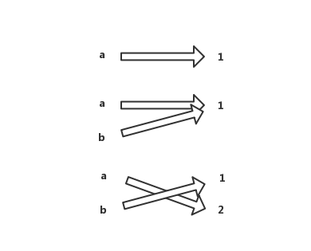
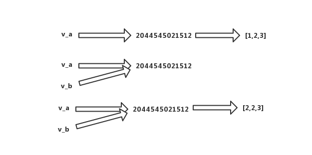
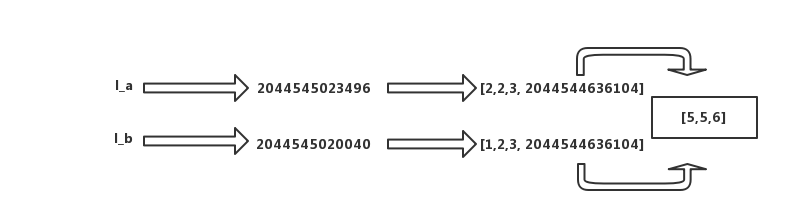

# 数据运算

## 1、变量

这里我们重新完整补充下Python中变量的信息。

### 1.1 变量的定义

> 补充知识，补充一下关于变量的详细信息

变量的概念基本上和初中代数的方程变量是一致的，只是在计算机程序中，变量不仅可以是数字，还可以是任意数据类型。我们可以简单理解为是一组数据的别称，对于**变量命名一定要有意义**，对于变量的官方给的规范是：**数字字母下划线组成，不能以数字开头**。

在目前最新版的Python3中，支持以中文当做变量使用，但是非常不建议使用。

```python
In [1]: 姓名="Evan"
```

变量在Python中推荐使用下划线来进行区分变量，当然也有喜欢用驼峰命名方法，这个看个人习惯即可。

```python
# 小驼峰
dataBaseUser = 1
# 下划线形式
data_base_user = 1
```

这里`=`在Python语言里面表示是赋值，将等号右边的赋值给左边。

### 1.2 值类型与引用类型

简单来说，值类型变量存储的是值，而引用类型变量则存储的是值得内存地址，在Python中分两拨不可变类型和可变类型，按照我们前面学习的，简单来分下类：

- 不可变类型：数字，字符串，元组
- 可变类型：列表，集合，字典

我们通过一个例子来分下：

**不可变类型**

```python
In [2]: a = 1

In [3]: b = a

In [4]: a = 2

In [5]: b
Out[5]: 1
```

当b=a时，a和b同时指向了一块地址，当a修改数据后则指向新的空间，可以通过下图简单理解下。



可变类型：

```python
In [6]: v_a = [1,2,3]

In [7]: v_b = v_a

In [8]: v_a[0] = 2

In [9]: v_b
Out[9]: [2, 2, 3]
```

上面v_a将内存地址引用赋值v_b，v_a修改其中引用的数据后，并没有改变内存地址，所以v_b的值也相应跟随者改变。TIps: 如果直接修改v_a = 2 ? 会怎么样呢？




上图中的2044545021512，我们可以看做是引用的内存地址。

> 在Python中，值类型和引用类型并不和其他语言的概念很强，这里简单清楚即可。

### 1.3 深Copy和浅Copy

深浅Copy，曾经一度困扰我的问题，其实当我们懂了上面的引用类型后，其实就非常简单了，我们看一个demo。

我们首先通过copy模块，copy一个不一样嵌套列表：

```python
In [11]: l_a = [1,2,3,[4,5,6]]

In [12]: import copy

In [13]: l_b = copy.copy(l_a)

In [14]: id(l_a)
Out[14]: 2044545023496

In [15]: id(l_b)
Out[15]: 2044545020040
```

> import copy 是一个内置的模块，这个是固定的引用语法，而copy.copy则是模块提供的函数。

假如这里我们修改列表中值会怎么样呢？

```python
In [16]: l_a[0] = 2

In [17]: l_a[3][0] = 5

In [18]: l_a
Out[18]: [2, 2, 3, [5, 5, 6]]

In [19]: l_b
Out[19]: [1, 2, 3, [5, 5, 6]]
```

不知道小伙伴们，看到这里是不是懂了呢？我们画一个简图看下



那遇到这种情况我们如何解决呢？我们可以使用Python的deepcopy来搞定。

```python
In [21]: l_b = copy.deepcopy(l_a)

In [22]: l_a[3][0] = 4

In [23]: l_a
Out[23]: [2, 2, 3, [4, 5, 6]]

In [24]: l_b
Out[24]: [2, 2, 3, [5, 5, 6]]
```

**这个地方很重要，希望遇到的小伙伴额外注意下。**

## 2、运算

Python中的运算，包含如下：算数运算符、赋值运算符、关系运算符、逻辑运算符、成员运算符、身份运算符和位运算符。

### 2.1 算数运算符

数学运算，主要来解决我们日常数学计算的问题，这里我们简单列举几个：

```python
In [25]: 1+2
Out[25]: 3

In [26]: 1-2
Out[26]: -1

In [27]: 1*2
Out[27]: 2

In [28]: 1/2
Out[28]: 0.5

In [29]: 1//2
Out[29]: 0

In [30]: 1%2
Out[30]: 1

In [31]: 2**2
Out[31]: 4
```

我们上面列举了，加减乘除，取余，阶乘，当然了还有很多这里就不一一讲解了。

### 2.2 赋值运算符

赋值运算符就是赋值+运算的一种简写，比如：

```python
In [34]: c = 0

In [35]: c += 1

In [36]: c
Out[36]: 1
```

其实这里，c+=1 是等价于下面：

```python
In [37]: c = c + 1

In [38]: c
Out[38]: 2
```

其他的运算符，加减乘除等等都是支持的，大家可以自己调试。

### 2.3 比较运算符

比较运算也相对较为简单，跟小学数学中的比较是一样的：

```python
In [39]: a = 1

In [40]: b = 2

In [41]: a > b
Out[41]: False

In [42]: a < b
Out[42]: True

In [43]: a == b
Out[43]: False

In [44]: a != b
Out[44]: True

In [45]: a >= b
Out[45]: False
```

在Python中，还可以进行复杂的比较运算：

```python
In [46]: 'a' == 'b'  
Out[46]: False

In [47]: 'a' > 'b'            # 这里会把字符串转化成为相关的十进制码点
Out[47]: False

In [48]: [1,2,3] == [1,2,4]
Out[48]: False

In [49]: [1,2,3] > [1,2,4]    # 这里遵循递进规则
Out[49]: False
```

这里给大家来个开拓性的运算， `b+=b>1` ? 这个b会是多少呢？

> 大家可以先猜想一下，然后在放到Python解释器中，你答对了吗？

### 2.4 逻辑运算符

逻辑运算符，操作的类型和返回类型都是布尔型，下面我们来简单测试下。

```python
In [50]: True and True
Out[50]: True

In [51]: True and False
Out[51]: False

In [52]: True or False
Out[52]: True

In [53]: not False
Out[53]: True
```

逻辑运算符Python中就是上面集中类型了，and, or, not

返回的类型都是布尔型？

```python
In [54]: None or 'mysql:xxxxxxx'
Out[54]: 'mysql:xxxxxxx'
```

> None 也表示False的一种，其中空字符串，空列表，空字典都是。 **重点来了: Python关系运算完成后他会返回为True的值。**那么上面说的返回都是布尔类型不对吗？ 有内容，有数据 难道不是真？（True）。

### 2.5 成员运算符

主要用于判断，是否存在与目标对象里面，我们看下实例：

```python
In [55]: 'a' in 'abc'
Out[55]: True

In [56]: 'a' not in 'abc'
Out[56]: False
```

那么列表，数组，字典，数字可以？ 大家可以自行尝试一下。

### 2.6 身份运算符

身份运算符，关键词有: is , not is; is 和 == 什么区别呢？ 这里我们还没学习到对象，可以简单理解为 == 比较的是值，而 is 比较的是内存地址。

我们通过下面这个实例来看下效果：

```python
In [60]: a = 1

In [61]: b = 1.0

In [62]: a == b
Out[62]: True

In [63]: a is b
Out[63]: False

In [64]: id(a)
Out[64]: 1694395408

In [65]: id(b)
Out[65]: 2044545500072
```

### 2.7 位运算符

按位运算符是把数字看作二进制来进行计算的。Python中的按位运算法则如下：

下表中变量 a 为 60，b 为 13，二进制格式如下：

```
a = 0011 1100

b = 0000 1101

-----------------

a&b = 0000 1100

a|b = 0011 1101

a^b = 0011 0001

~a  = 1100 0011
```

这里简单理解下就好，简历一个索引，等有需要的时候我们去查询相关的资料。

### 2.8 运算符的优先级

以下表格列出了从最高到最低优先级的所有运算符：

| 运算符                   | 描述                                                   |
| ------------------------ | ------------------------------------------------------ |
| **                       | 指数 (最高优先级)                                      |
| ~ + -                    | 按位翻转, 一元加号和减号 (最后两个的方法名为 +@ 和 -@) |
| * / % //                 | 乘，除，取模和取整除                                   |
| + -                      | 加法减法                                               |
| >> <<                    | 右移，左移运算符                                       |
| &                        | 位 'AND'                                               |
| ^ \|                     | 位运算符                                               |
| <= < > >=                | 比较运算符                                             |
| <> == !=                 | 等于运算符                                             |
| = %= /= //= -= += *= **= | 赋值运算符                                             |
| is is not                | 身份运算符                                             |
| in not in                | 成员运算符                                             |
| not and or               | 逻辑运算符                                             |

## 3、总结

本节需要特别注意的知识点：

- 变量命名
- 深浅Copy
- 赋值运算、成员运算符、身份运算符、运算符的优先级

